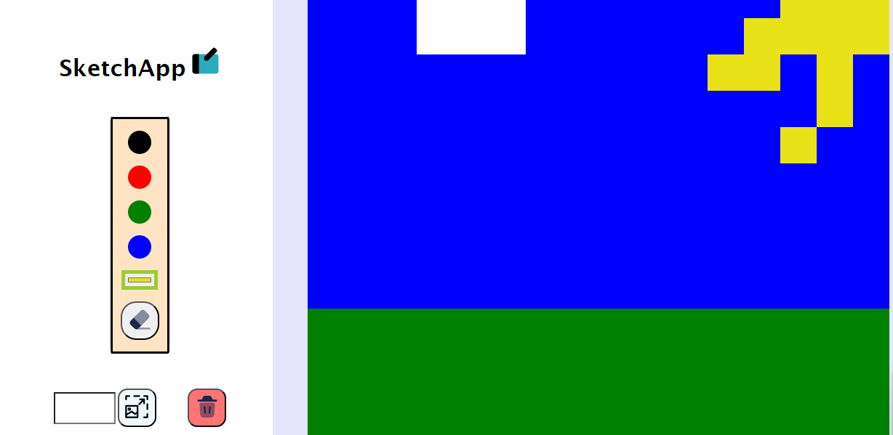

# Etch-A-Sketch

## Description
An Etch-A-Sketch application focused on DOM manipulation with Javascript.

Live Demo: https://ahmed-mgd.github.io/etch-a-sketch/

## Features
1. Versatile Color Palette and Eraser Tool: user can select colors to draw with from preset options or pick from a color wheel.
2. Grid Manipulation: ability to resize and reset grid.

## Lessons
- Practice with DOM manipulation

## Challenges
- When the user hovers over a square, it was slightly difficult to differentiate between "highlighting" (mouse up) and "shading" (mouse down) while minimizing points of control. I ultimately used a variable to keep track of the state of the mouse (up/down) and used a single toggle function to check the status and change the square accordingly.
- I initially used a class for "highlighting" squares and modified the inline CSS for actually "shading" the squares. This was problematic as inline CSS takes precedence over the class. As a result, once the square is erased (reset to gray), the highlighting no longer appears. To solve this issue, I instead manipulated the opacity for highlighting so that there would be no conflicts with the shading logic.
- Struggled with using the same amount of pixels for different grid sizes. At first experimented with calculating and setting the size manually with JS, but I eventually realized the easiest way to go about it was by using "align-items: stretch".

## Known Problems/Bugs
- Color picker only moidifies color when directly clicked
- App occasionally gets stuck in "mouse down" state
- Could improve styling

## Credits
Project concept derived from The Odin Project:
https://www.theodinproject.com/lessons/foundations-etch-a-sketch